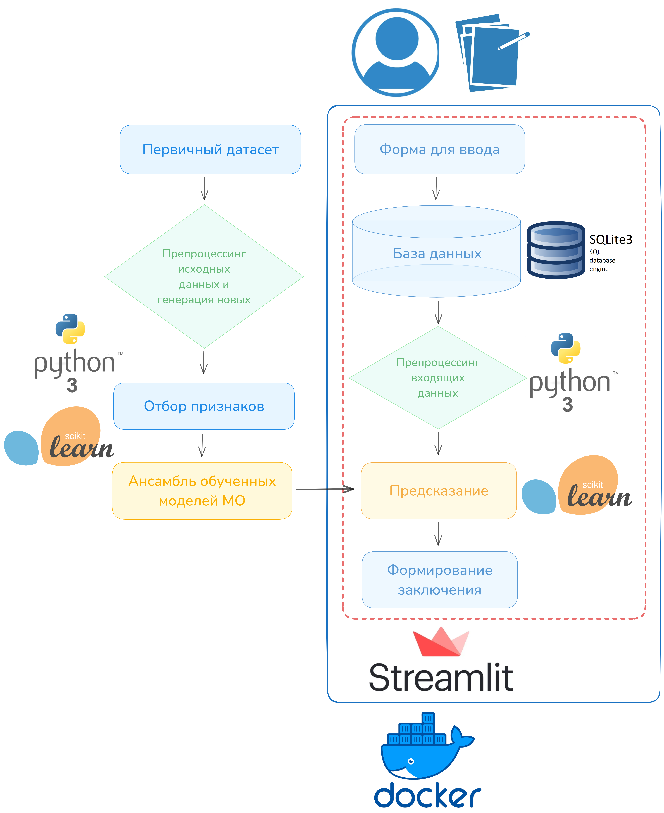

<h1 align="center">Команда №2 МФТИ </a> 

<h2 align="center"> SharkLab prod.
<h3 align="center"> Акула-гематолог Блуди  -  Ваш помощник в интерпретации анализа крови

</h1>


#### ⭐ Команда SharkLab:

##### Казаченко Екатерина
###### Тимлид команды,практикующий врач,всегда на гребне новых технологий

##### Бондарева Алина
###### Гений моделированияи интерпретации медицинских данных

##### Борковская Евгения
###### Исследователь данных, отвечает за сбор, обработкуи валидацию медицинских данных, а также ихинтеграцию в систему

##### Хван Ок Хи
###### Архитектор цифровых платформ, отвечает за разработку веб-приложения иинтеграцию интерфейса спомощью Streamlit

### Задача
Разработать сервис (встроить его в браузер, сделав облачным и доступным по ссылке),который на основе данных общего анализа крови проводит диагностику и выдаетрекомендацию обратится к определенному врачу (или нет) с указанием срочности.

Материалы: [датасет с лабораторными показателями общего анализа крови пациентов с лейкозом](https://drive.google.com/file/d/10QgBo85UljD1u-aTHakks7VbihuoSKAi/view?usp=drive_link)

## Методология решения

### 1) Препроцессинг данных:

	- Кодирование пола (0 - женский, 1 - мужской) и расчет возраста

Задача: Преобразовать пол в числовой формат и вычислить возраст пациентов.

Решение:

	  - Кодирование пола с помощью маппинга (0 - женский, 1 - мужской)
	  - Вычисление возраста на основе даты рождения и текущей даты. 

- Обработка пропусков и получение информации из комментариев

Задача: Обработать текстовые комментарии и заполнить пропуски в данных.

Решение:

	  - Удаление неинформативных комментариев
	  - Обработка каждого комментария с ценной информацией, которую можно восстановить (например, количество посчитанных вручную клеток)

- Унификация названий лабораторных показателей:

Задача: Обеспечить, чтобы все лабораторные показатели имели одинаковые, стандартные названия.

Решение:

	  - Создание словаря с маппингом альтернативных названий к стандартным.
	  - Применение этого словаря ко всем записям для переименования показателей.

- Приведение единиц измерения к стандарту

Задача: Обеспечить, чтобы каждый параметр имел стандартизированную единицу измерения.

Решение:

	  - Создание словаря с альтернативными единицами измерения к стандартным.
	  - Применение этого словаря ко всем записям для преобразования единиц измерения.

- Нормализация показателей по возрасту и полу

Задача: Привести показатели к единому масштабу с учетом возраста и пола пациентов.

Решение:

	  - Использование нормализующих функций для стандартизации данных в соответсвии с полом и возрастом

- Удаление неинформативных показателей общего анализа крови

Задача: Оставить только те показатели общего анализа крови, которые входят в страндартный набор для всех пациентов, чтобы в дальнейшем строить предсказательную модель не только для пациентов с диагнозом лейкоз, но и для всех других.

Решение:

	  - Оценка представленности каждого параметра в датасете
	  - Удаление наименее представленных

- Финальная подготовка данных к обучению модели

Задача: Подготовить данные к следующему шагу

Решение:

	  - Оставляем только столбцы с количественными показателями крови, полом, возрастом, ID историй болезни и меток диагнозов.
	  - Оцениваем представленность каждого показателя крови у каждого пациента
	  - Формируем векторы для каждого пациента по ID в отдельные csv-файлы через pivot_table (у одного пациента их может быть несколько, так как пациенты могли сдавать анализ крови не один раз).
	  - Сохранение преобразованных данных в папку done в отдельные CSV-файлы и объединение в один суммарный CSV-файл - data/leucosis.csv

Очищенные данные доступны по [ссылке](https://drive.google.com/file/d/1gXuESfYuBrT3xiahz5kPuQzqysfuAA0f/view?usp=drive_link)

Ноутбук доступен по [ссылке](preprocessing.ipynb)

### 2) Макет решения
   
- Создание уникальной концепции бренда для веб-сервиса, вдохновленный акульей тематикой, а также макета для веб-сервиса
- Определение обязательных параметров общего анализа крови, характерных для большинства людей, а не только для пациентов с лейкозом
- Разработка дизайн-макета, сочетающего профессионализам акулы-гематолога и легкость восприятия интерфейса
- Интеграция всех компонентов в цельное решение, которое делает анализ крови доступным и понятным для людей любого возраста

### 3) Дополнение данных

- Для дополнения данных результатами общего анализа крови по другим диагнозам был сгенерирован еще один датасет на основе зависимостей лабораторных показателей общего анализа крови от некоторых заболеваний. Таким образом, сгенерировано 2000 строк с такими же столбцами, как и в обработанном датасете и все данные объединены в финальный датасет, который был использован в дальнейшем для обучения ивалидации моделей.

Датасет по анемии и с нормой доступен по [ссылке](https://drive.google.com/file/d/1iH_rhreNfI_rNNrCjSd3bABFCUZT_Qn3/view?usp=drive_link)

Датасет по другим диагнозам доступен по [ссылке](https://drive.google.com/file/d/1oVLmCSdQa43nIhVzvqps22VuXLXm7X9i/view?usp=drive_link)
  
Ноутбук доступен по [ссылке](code_for_generating_data.ipynb)

- Датасет для тестирования моделей с реальными данными из открытых источников

Финальный датасет был создан на основе данных NHANES (National Health and Nutrition Examination Survey), доступных на [сайте](https://wwwn.cdc.gov/Nchs/Nhanes/). Эти данные предоставляют обширную информацию о состоянии здоровья и питания населения США. В частности, мы использовали датасет [«Complete Blood Count with 5-Part Differential in Whole Blood»](https://drive.google.com/file/d/1haDagkxWFf7V3fckdA5ZYZLSb8_Gm8W2/view?usp=drive_link) (CBC) для получения лабораторных показателей и [«Demographic Variables and Sample Weights»](https://drive.google.com/file/d/1Cq6qaI_2nlXlRz_6byGyWYNKNMjicK8Z/view?usp=drive_link) (DEMO) для признаков пол и возраст. 

Для подготовки данных была проведена следующая обработка:

1.	Добавление признаков Age и Sex из датасета DEMO.
2.	Обработка признака Sex: замена исходных значений на: 0 — мужчины, 1 — женщины.
3.	Переименование колонок.
4.	Масштабирование данных: значения в колонках LBXMC и LBXHGB были преобразованы в унифицированные в РФ единицы измерения.
5.	Удаление ненужных колонок: исключили из датасета переменные WTPH2YR (вес выборки за 2 года) и LBXNRBC (нуклеированные эритроциты), так как их не было в предоставленном заказчиком датасете.
6.	Обработка пропусков: для обеспечения качества данных удалили строки с количеством пропусков, превышающим 5 на одну запись.

Ноутбук доступен по [ссылке](NHANES_data/dataset_pre.ipynb)

Обработанный датасет доступен по [ссылке](https://drive.google.com/file/d/1gIkdoUK71sgDmJRet5AP4ncYZ1HL4JJI/view?usp=drive_link)

### 4) Изучение взаимосвязи и выбор признаков для обучения моделей

- Анализ корреляции:
Построение корреляционной матрицы и тепловой карты для лучшей визуализации и оценки силы корреляционной связи. Признаки, имеющие сильную корреляцию (от 0,7 до 0,9) было принято удалить.

- Расчет коэффициентов взаимной информации (Mutual Information, MI): MI демонстрирует абсолютную меру взаимосвязи между признаком и целевой переменной вне зависимости от конкретной модели.

- Feature Importance (Важность признаков):
Использование алгоритмов Random Forest для оценки важности признаков и визуализации с помощью столбчатой диаграммы. Далее для отбора признаков была выполнена перекрестная проверка (cross-validation) для подбора оптимального порога отсечения важности признаков.

- SelectKBest:
Отбор признаков на основе статистических тестов с помощью метода SelectKBest. Отбор признаков выполнен на основе статистического теста ANNOVA (параметр score_func=f_classif) и с помощью регрессионного анализа (параметр score_func=f_regression)

- AdaBoostClassifier: AdaBoost (Adaptive Boosting) - это ансамблевый метод машинного обучения, который использует последовательность слабых классификаторов для построения сильного классификатора. В контексте отбора признаков, AdaBoostClassifier отбирает признаки на основе их важности (весов моделей), которая определяется в ходе обучения модели.

По результатам оценки важности признаков был создан список параметров анализа крови, которые были отмечены моделями как наиболее важные. Эти параметры будут обязательно заполнять в форме (за исключением показателей лекоцитарной формулы, которые не входят в стандартный набор параметров ОАК).

Ноутбук доступен по [ссылке](feature_selection.ipynb)

Список отобранных парамтеров доступен по [ссылке](selected_important_features.txt)

### 5) Выбор моделей машинного обучения, построение ансамбля моделей и обучение
   
- Для создания ансамбля моделей и реализации голосования за подозрение на заболевание на основе превышений показателей ОАК были применены следующие алгоритмы:
  
	  - LogisticRegression
  
	  - GaussianNB
  
	  - DecisionTree
  
	  - RandomForrest
  
	  - xgboost
  
	  - LGBM
  
	  - MLP
  
- В качестве метрики качества работы моделей была выбрана точность (Accuracy), которая рассчитывалась на тестовой выборке для каждого алгоритма

Скрипты с обучением моделей доступны в папке [train_models](train_models). Также в этой папке находится скрипт [norms.py](train_models/norms.py) - скрипт с нормами каждого параметра, к которому модели обращаются во время обучения.

Скрипт ансамбля моделей доступен по [ссылке](train_models/ensemble_predict.py)

Обученные модели в формате pkl для формирования предсказания в [папке](app/models)

### 6) Оформление интерфейса сервиса с помощью Streamlit с подключением БД SQlite3

- В качестве пользовательского интерфейса, мы решили зайдествовать streamlit, так как он прост в использовании, имеет все необходимые интерактивные элементы и поддерживает интеграцию со всеми известными библиотками визуализации, а также прост в разворачивании и обладает кроссплатформенностю.

- В качестве хранилища обрабатываемых данных, мы используем БД SQlite3, так как она не требует сложной настройки и конфигурации, обладает кроссплатформенностью, поддерживает язык SQL, а также поддерживает принципы ACID для обеспечения надежности и безопасноти при операциях с данными.

Скрипт для запуска Streamlit доступен по [ссылке]app/str.py)

Скрипты для двух других страниц веб-сервера доступны в [папке](app/pages)

Скрипт для создания таблицы с заданной структурой доступен по [ссылке](app/migrations.sh)

### 7) Настройка взаимодействия всех элементов сервиса

Задача: Соединение всех элементов в один рабочий сервис, проверка взаимодейсвия этих элементов (форма для введения данных - БД - предсказание - формирование заключения - вывод заключения)

Логика решения:

	- Пользователь вводит свои параметры общего анализа крови на сервере
 
	- Данные сохраняются из формы на веб-сервере в БД
 
 	- Обработка входищх данных и проверка на коррекность значений
  
  	- Предсказание на основе предобученного ансамбля моделей
   
   	- Формирование заключения
    
   	- Вывод заключения в финальную форму пльзователю

Решение реализовано в [скрипте](app/classify_diagnosis.py)

### 8) Тестирование сервиса

Проверка корректности и логики работы сервиса и выдаваемых рекомендаций, оценка скорости работы.

Пример формируемой БД доступен по [ссылке]()
#### ❗ Здесь надо сделать пример базы данных на реальных анализах ❗

## Архитектура сервиса



### Как запустить: 

1) Запуск со сборкой образа

Все, что необходимо для запуска сервиса находится в папке [app](app). Скачайте полностью эту директорию, далее откройте ее в любом удобном для Вас текстовом редакторе кода или в терминале. 

Сборка докер-образа:

```
docker build -t hakaton2024 .
```

Запуск веб-сервиса

```
docker run -it --rm -p 8501:8501 -v $PWD/data:/app/data --name=hakaton_container hakaton2024
```

Далее Вас автоматически перенаправят в браузер на веб-сервис или перейдите самостоятельно по ссылкам, предложенным в терминале 

2) Запуск с помощью опубликованного образа на [Docker Hub]([https://hub.docker.com/](https://hub.docker.com/repository/docker/ekaterinakaz4255/hakaton2024/general))

Запуск веб-сервиса по ссылке на докер-образ

```
# Загрузите докер-образ
docker pull ekaterinakaz4255/hakaton2024

# Запустите контейнер
docker run -it --rm -p 8501:8501 -v $PWD/data:/app/data --name=blood_container ekaterinakaz4255/hakaton2024
```
Далее Вас автоматически перенаправят в браузер на веб-сервис или перейдите самостоятельно по ссылкам, предложенным в терминале 

### Готово!
Сервис запущен, и теперь можно испытать его в деле.

## Сервис по расшифровке общего анализа крови - SharkLab

Итак, вы на главной странице сервиса SharkLAb, где Вас встретит наш Акула-гематолог Блуди (от англ. bloody - кровавый). Здесь важно прочитать вводную информацию о нашем сервисе и, если согласны, нажимайте кнопку в самом низу страницы, которая перенаправит Вас дальше. 


Теперь Вам необходимо внести такие параметры, как пол, вес рост, дату рождения и необходимые для заключения лабораторные показатели общего анализа крови. После корректного заполнения всех обязательных полей Вы будете перенаправлены на страницу с заключением от нашего Акулы-гематолога Блуди. 


А вот и Ваше заключение:


Иногда в работе сервиса могут возникать ошибки, связанные с некорректным запуском, стабильностью соединения и предсказанием Вашего состояния на основе введенных данных. При возникновении ошибок, стоит попробовать еще раз вернуться на главную страницу и пройти весь путь еще раз. Если ошибка снова возникает, наша команда с удовольствием поможет разобраться и не оставит ни одного пользователя без желаемого заключения.
